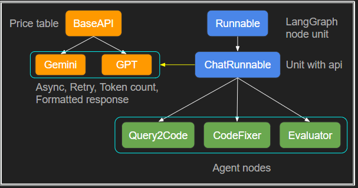
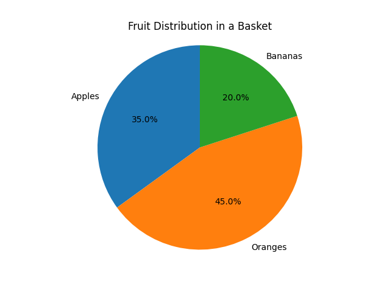

## Introduction
RAG (Retrieved, Augmentated, Generation) and AGENT tools.


## Motivation

1. **Extended LLM call** <br>
    Based on `Gemini` and `OpenAI` official API, extend more useful functions include:
    
    | API       | Async      | Retry              | Get token/price | Formatted response | Img Input |
    | -         | -          | -                  | -               | -                  | - |
    | Official  | ⚠️ Wrapper | ❌ Not support    | ⚠️ Hassle       | ✅ Server-side (strong) | ✅ |
    | LangChain | ⚠️ Wrapper | ⚠️ conn. only     | ⚠️ Hassle       | ⚠️ Client-side (medium) | ✅ |
    | Ours      | ✅ Call    | ✅ conn. & format | ✅ .get_price() | ✅ Server-side (strong) | ✅ |
    
    see implementation details of [Gemini](ragentools/api_calls/google_gemini.py) and [GPT](ragentools/api_calls/openai_gpt.py)

2. **Agents** <br>
    + Based on **Extended LLM call** and **LangChain Runnable**, build complex agent by `LangGraph` efficiently.

    | Method      | Node                                   | Pattern | 
    | -           | -                                      | -       |
    | Traditional | Functions                              | Messy and hard to scale-up |
    | LangGraph   | Extended LLM call + LangChain Runnable | Clean code due to [Blackboard Design Pattern](https://en.wikipedia.org/wiki/Blackboard_(design_pattern)) |
    
    + Structure Design <br>
        
    
    + Example: Text2Chart agent
        + graph (generated by code) <br>
            
        + [Agent Implementation Example](agents/text2chart/v1/main.py)
        + output folder: `agents/text2chart/v1/save/matplotbench_easy`

3. **RAG**
    + Parsers
        + BaseParser -> PDFParser, TextParser
        + About chunk size
            + Too fragmented -> Low k@recall or Low context recall -> Need to increase
            + Too much irrelevent -> Low k@precision -> Need to decrease
    + Indexers
    + Retrievers
    + Evaluators - RAGAs
        + RAGAs <br>
            
        + Tuning strategy
        
| Metrics        | Method       | Used | Target | Meaning | Tuning |
| -              | -            | -    | -      | -       | -      |
| k@precision    | LLM as judge | Y | Retrieved-Query    | How many chunks are closely related to the query | Reduce chunk size |
| k@recall       | Precompute   | N | Retrieved-Query    | How many chunks for generating this QA is retrieved | - |
| context recall | LLM as judge | Y | Retrieved-GT       | How many chunks are helpful to the GT | increase chunk size, top-k |
| faithfulness   | LLM as judge | Y | Retrieved-Response | How many chunks are helpful to the Response | low context recall: increase chunk size, overlap, top-k<br> high context recall: LLM hallucinates or do not need RAG |
| relevancy      | LLM as judge | Y | Query-Response     | Whether LLM understand query | Enhance LLM or prompt |
| correctness    | LLM as judge | Y | Response-GT        | Overall score | - |


## Installation
```bash
pip instal -e .
```

## Examples
#### 1. Call API
following code with the features
+ 1 formatted response: dictionary followed by Google official configuration.
+ 2 image input: followed by Google official configuration
+ 3 async: call `amain_wrapper(async_func: Callable, arg_list: List[Dict])` to easily harness async program.
+ 4 retry: based on tencaity, customize retry times and intervals.
+ 5 get price: use `.get_price()` easily. Update the price table in [here](ragentools/api_calls/prices.csv)

```python
import yaml

from ragentools.api_calls.google_gemini import GoogleGeminiChatAPI
from ragentools.api_calls.langchain_runnable import ChatRunnable
from ragentools.common.async_main import amain_wrapper
from ragentools.common.formatting import get_response_model
from ragentools.prompts import get_prompt_and_response_format


api_key = yaml.safe_load(open("/app/tests/api_keys.yaml"))["GOOGLE_API_KEY"]
runnable = ChatRunnable(
    api=GoogleGeminiChatAPI,
    api_key=api_key,
    model_name="gemini-2.0-flash-lite"
)


response_format = {"description": {"type": "string"}}  # 1 formatted response
parts = [
    {"text": "What's in this picture?"},
    {"inline_data": {
        "mime_type": "image/jpeg",
        "data": open("/app/tests/api_calls/dog.jpg", "rb").read()
    }}
]  # 2 image input
results = amain_wrapper(  # 3 async
    self.runnable.arun,
    [
        {
            "input": {
                "prompt": [{"role": "user", "parts": parts}],
                "response_format": response_format,
                "retry_times": 3,  # 4 retry 
                "retry_sec": 5
            }
        }
    ]
)


expect_response_format = get_response_model(response_format)
expect_response_format(**results[0])
print(results)               # 1 formatted response
print(self.runnable.api.get_price())  # 5 get price
```

The outcome will be
```
[{'description': 'A black and white Border Collie is sitting and looking at the camera.'}]
0
```

#### 2. Text2Chart agent
+ code
    + Each node
        + Inherits "LangChain Runnable" for graph scalability
        + Has attribute "Extended LLM Call" for api benefits.
```bash
python agents/text2chart/v1/main.py
```

+ graph <br>
    

+ prompts are in [here](ragentools/prompts/text2chart).
For instance, the eval prompt
```yaml
prompt: |
  **Task:** You are an expert in evaluating a diagram generated from code written by a LLM, in response to a user's query.
  Your goal is to assess how accurately the diagram fullfills the user's intent.

  **Evaluation Scope:**
  Focus only on aspects that directly relate to the accuracy and informativeness of the diagram, as determined by the user's query.
  Ignore stylistic features such as color schemes, font styles, line thickness, or point markers, etc.

  **Evaluation Criteria:**
  Assess the diagram using the following four criteria. For each, select a score from the scale provided.
  1. Representative:
      Is the chosen diagram type (e.g., bar chart, line chart, scatter plot, pie chart) appropriate for visualizing the data and answering the user's query?
      **Scale**
      - 0 (Barely representative)
      - 1 (Partially representative)
      - 2 (Mostly representative)
  2. Data consistency:
      Do the data values shown in the diagram match what is implied or explicitly described in the user's query?
      If the query does not mention specific data values or ranges, consider it consistent.
      **Scale**
      - 0 (Barely consistent)
      - 1 (Partially consistent)
      - 2 (Mostly consistent)
  3. Scale correctness:
      Are the axes' scales (e.g. range, units, intervals) appropriate and correct based on the user's query?
      If the query does not specify scales or if the diagram does not require them (e.g. pie charts), consider it correct.
      - 0 (Barely correct)
      - 1 (Partially correct)
      - 2 (Mostly correct)
  4. Label accuracy:
      Are the diagram title, axes labels, legends, and other textual annotations accurate with respect to the variables or categories specified in the query?
      Are any key components missing?
      - 0 (Barely accurate)
      - 1 (Partially accurate)
      - 2 (Mostly accurate)

  **Query:**  {{ query }}

  **Response:** Provide a structured JSON.

default_replacements: {}

response_format:
  representative:
    type: integer
  data_consistency:
    type: integer
  scale_correctness:
    type: integer
  label_accuracy:
    type: integer
  explanation:
    type: string
```

+ config is in [here](agents/text2chart/v1/agents_text2chart_v1.yaml)
```yaml
api:
  api_key_path: /app/tests/api_keys.yaml
  api_key_env: GOOGLE_API_KEY
  model_name: gemini-2.0-flash-lite

mode: PLOT  # PLOT or RUN
data_path: /app/agents/text2chart/data/matplotbench_easy/data.json
save_folder: /app/agents/text2chart/v1/save/matplotbench_easy/

prompts:
  gen_path: /app/ragentools/prompts/text2chart/gen.yaml
  fix_path: /app/ragentools/prompts/text2chart/fix.yaml
  eval_path: /app/ragentools/prompts/text2chart/eval.yaml
  refine_path: /app/ragentools/prompts/text2chart/refine.yaml
```

+ dataset is in [here](agents/text2chart/data/matplotbench_easy/data.json).<br>
```json
[
    {
        "instruction": "Create a pie chart:\n\nThe pie chart represents the distribution of fruits in a basket, with the proportions being 35% apples, 45% oranges, and 20% bananas",
        "id": 5
    },
    {
        "instruction": "Generate a Python script using matplotlib to create a 4x4 inch figure that plots a line based on array 'x' from 0.0 to 10.0 (step 0.02) against 'y' which is sine(3pix). Set the x-axis limit from -2 to 10 and the y-axis limit from -6 to 6.",
        "id": 9
    },
    {
        "instruction": "Could you assist me in creating a Python script that generates a plot with the following specifications?\n\n1. The plot should contain three lines. The first line should represent the square of a numerical sequence ranging from 0.0 to 3.0 in increments of 0.02. The second line should represent the cosine of '3*pi' times the same sequence. The third line should represent the product of the square of the sequence and the cosine of '3*pi' times the sequence.\n\n2. The plot should have a legend, labeling the first line as 'square', second line as 'oscillatory' and the third line as 'damped'.\n\n3. The x-axis should be labeled as 'time' and the y-axis as 'amplitude'. The title of the plot should be 'Damped oscillation'.\n\nCould you help me with this?\"",
        "id": 10
    }
]
```

+ output folder: `agents/text2chart/v1/save/matplotbench_easy`
    + example of "id=5" data
        + plot: <br>
            
        + eval:
```json
{
    "representative": 2,
    "data_consistency": 2,
    "scale_correctness": 2,
    "label_accuracy": 2,
    "explanation": "The pie chart accurately represents the fruit distribution with correct proportions and labels."
}
```

#### 3 RAG
